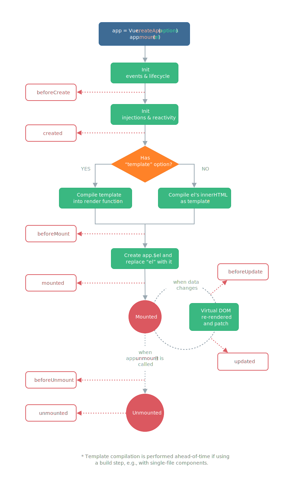

# Vue3.0 OptionsAPI

> Vue3.0选项式API

## （一）基础

### data()

### methods

#### 1、methods对象声明

```js
#方法
methods: {
    handleClick(){
    	console.log(this);//this指向vue实例vm
    }
},
```

```js
#属性:匿名函数
methods: {
    handleClick:function(){
        console.log(this);//this指向外层vue实例vm
    }
},
```

```js
#属性:箭头函数
methods: {
    handleClick:()=>{
        console.log(this);//this指向window
    }
},
```

> 注意：
>
> 当this指向vue实例时，通过`this.$data`可获得vue实例下的data methods等。

#### 2、methods对象使用

##### 2.1、v-on指令

##### 2.2、@指令

### computed

### watch

### Lifecycle Hooks

#### 生命周期事件

| 选项式 API        | Hook inside `setup` | 含义     |
| ----------------- | ------------------- | -------- |
| `beforeCreate`    | Not needed*         | 创建前   |
| `created`         | Not needed*         | 创建后   |
| `beforeMount`     | `onBeforeMount`     | 挂载前   |
| `mounted`         | `onMounted`         | 挂载后   |
| `beforeUpdate`    | `onBeforeUpdate`    | 更新前   |
| `updated`         | `onUpdated`         | 更新后   |
| `beforeUnmount`   | `onBeforeUnmount`   | 卸载前   |
| `unmounted`       | `onUnmounted`       | 卸载后   |
| `errorCaptured`   | `onErrorCaptured`   | 错误捕获 |
| `renderTracked`   | `onRenderTracked`   | 渲染跟踪 |
| `renderTriggered` | `onRenderTriggered` | 渲染触发 |

#### 生命周期图示



#### 示例

##### 跑秒表

> 要点
>
> `setInterval()` `mounted() `

```js
<div id="root"></div>
    <script>
        const app = Vue.createApp({
            template: `
            <div>{{ count}}</div>
            `,
            data() {
                return {
                    count: 1
                }
            },
            mounted() {
                // console.log(this.$data.count);// 可正常读取，this指向vue实例 vm
                setInterval(() => {
                     // console.log(this.$data.count);// 可正常读取，this指向vue实例 vm
                    this.count += 1//等价于：this$data.count += 1
                }, 1000);
            }
        })
        const vm = app.mount('#root')
    </script>
```


```js
Vue.createApp({
  data() {
    return { count: 1}
  },
  created() {
    // `this` 指向 vm 实例
    console.log('count is: ' + this.count) // => "count is: 1"
  }
})
```


## （二）升级
